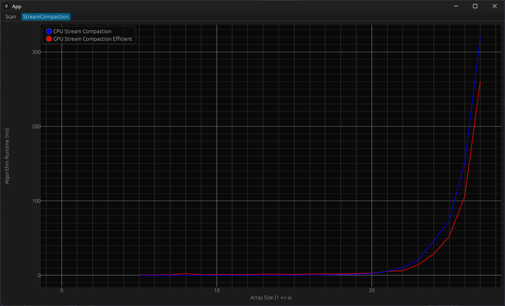
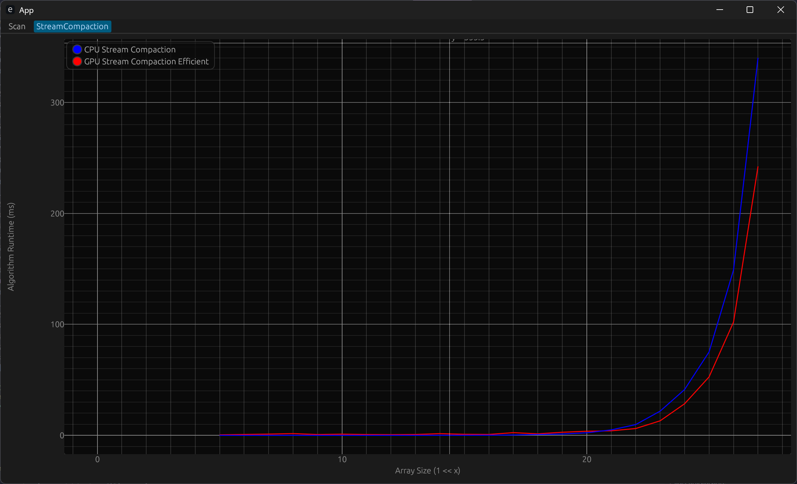

CUDA Stream Compaction
======================

**University of Pennsylvania, CIS 565: GPU Programming and Architecture, Project 2**

* Saahil Gupta
  * [LinkedIn](https://www.linkedin.com/in/saahil-g), [personal website](https://www.saahil-gupta.com)
* Tested on: Windows 11 10.0.26100, AMD Ryzen 9 7940HS @ 4.0GHz 32GB, RTX 4060 Laptop GPU 8GB

## Performance Analysis

### Scan

---

<table>
  <tr>
    <td></td>
    <td></td>
    <td></td>
  </tr>
</table>

### Stream Compaction

---

<table>
  <tr>
    <td></td>
    <td></td>
    <td></td>
  </tr>
</table>

