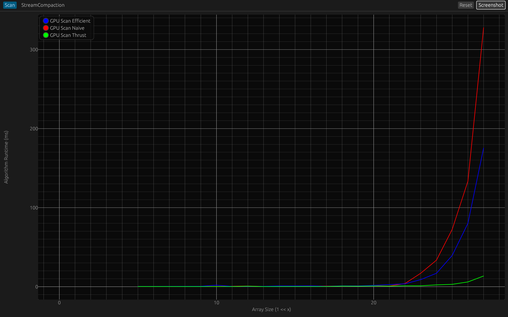
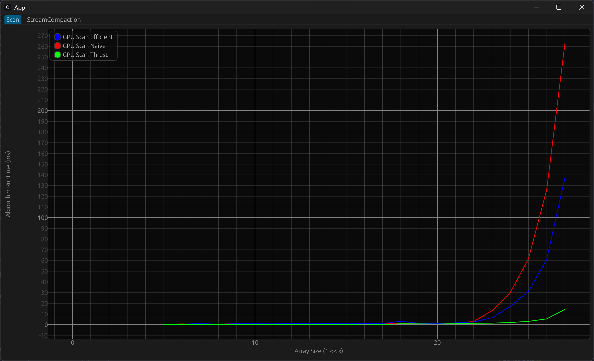
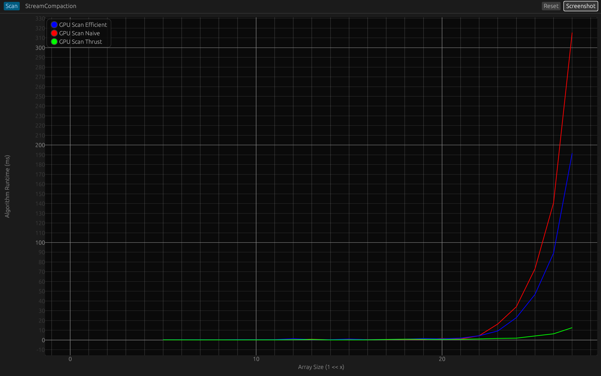
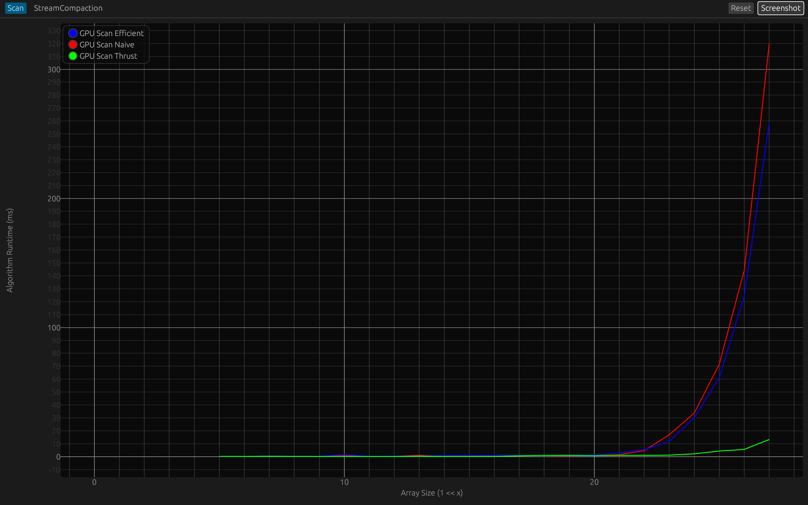
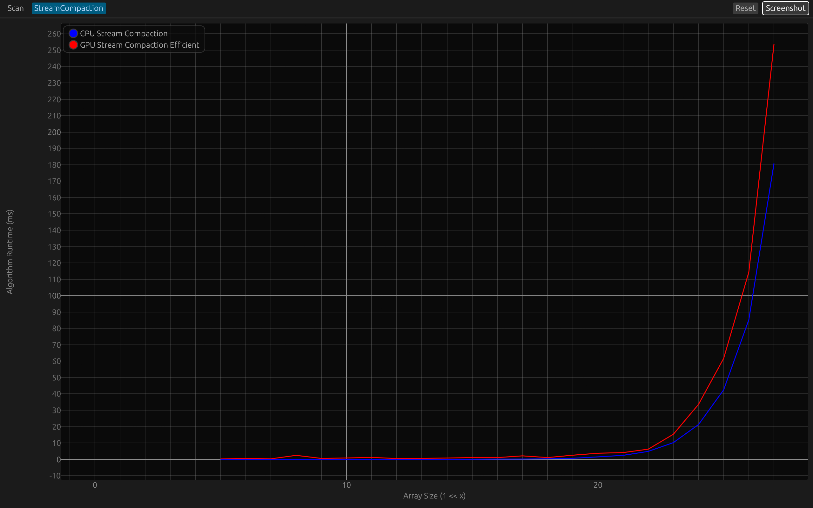
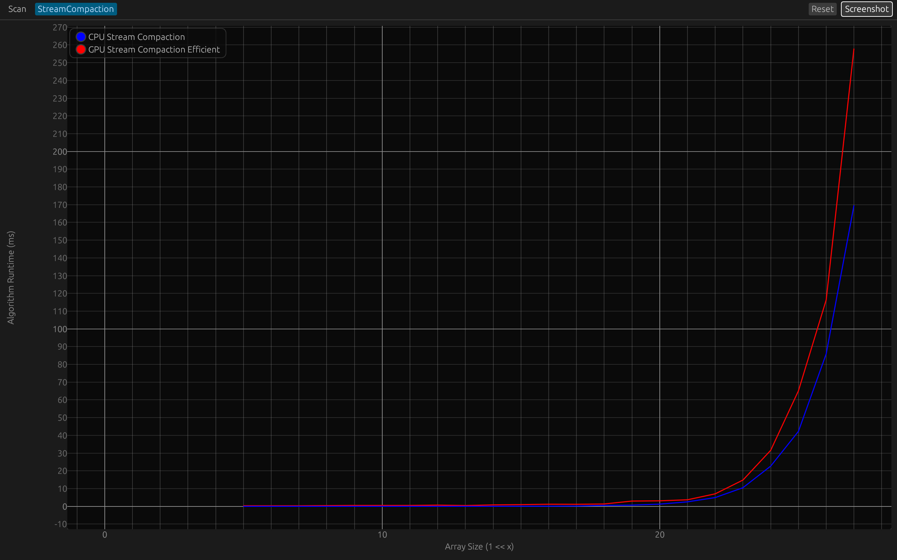
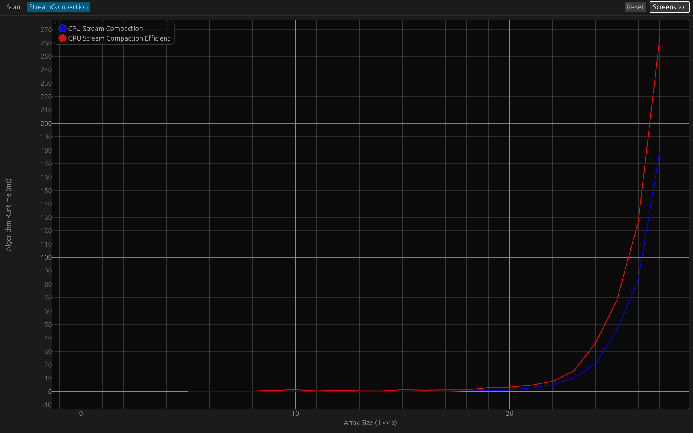
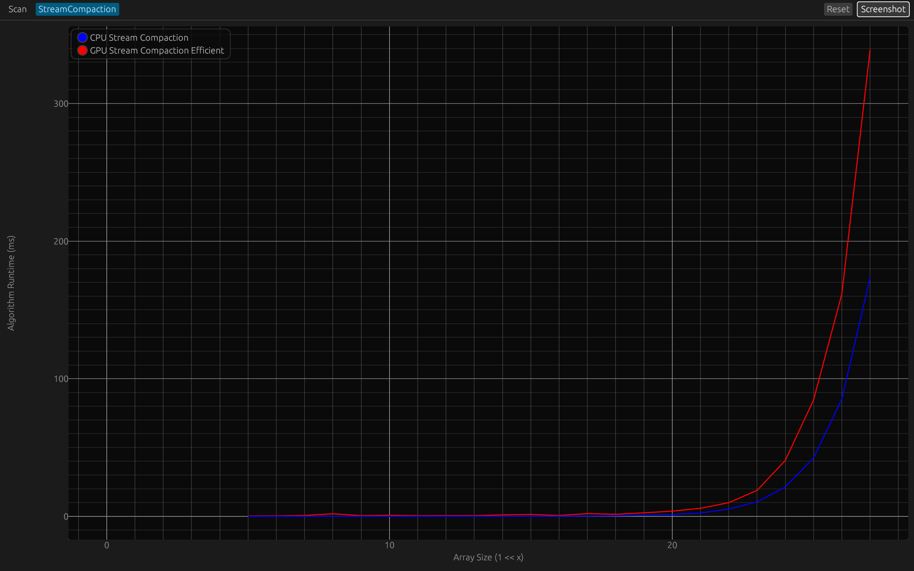

CUDA Stream Compaction
======================

**University of Pennsylvania, CIS 565: GPU Programming and Architecture, Project 2**

* Saahil Gupta
  * [LinkedIn](https://www.linkedin.com/in/saahil-g), [personal website](https://www.saahil-gupta.com)
* Tested on: Windows 11 10.0.26100, AMD Ryzen 9 7940HS @ 4.0GHz 32GB, RTX 4060 Laptop GPU 8GB

## Table of Contents

- [Performance Analysis](#performance-analysis)
  - [Basic](#basic)
    - [Scan](#scan)
    - [Stream Compaction](#stream-compaction)
  - [Thread](#thread)
    - [Thread-Efficient Scan](#thread-efficient-scan)
    - [Thread-Efficient Stream Compaction](#thread-efficient-stream-compaction)

## Performance Analysis

### Basic

### Scan

<em>Block Size 256</em>

<table>
  <tr>
    <td>
      
      <em>128</em>
    </td>
    <td>
      
      <em>512</em>
    </td>
    <td>
      
      <em>1024</em>
    </td>
  </tr>
</table>

### Stream Compaction

<em>Block Size 256</em>

<table>
  <tr>
    <td>
      <em>128</em>
    </td>
    <td>
      
      <em>512</em>
    </td>
    <td>
      
      <em>1024</em>
    </td>
  </tr>
</table>

### Thread Efficiency

### Thread-Efficient Scan

### Thread-Efficient Stream Compaction
