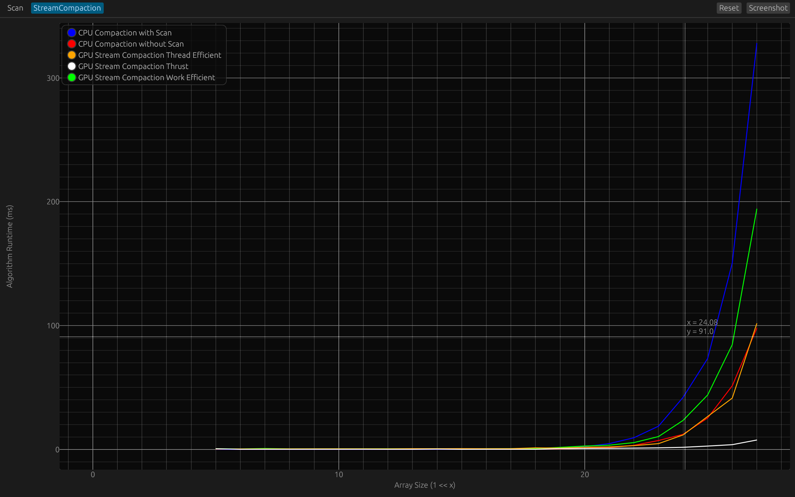

CUDA Stream Compaction
======================

**University of Pennsylvania, CIS 565: GPU Programming and Architecture, Project 2**

* Saahil Gupta
  * [LinkedIn](https://www.linkedin.com/in/saahil-g), [personal website](https://www.saahil-gupta.com)
* Tested on: Windows 11 10.0.26100, AMD Ryzen 9 7940HS @ 4.0GHz 32GB, RTX 4060 Laptop GPU 8GB

## Table of Contents

- [Performance Analysis](#performance-analysis)
  - [CPU](#basic-cpu-implementation)
    - [Scan](#scan)
    - [Stream Compaction](#stream-compaction)
  - [GPU Naive](#gpu-naive)
    - [Scan](#scan-1)
  - [GPU Work Efficient](#gpu-work-efficiency)
    - [Scan](#scan-2)
    - [Stream Compaction](#stream-compaction-1)
  - [GPU Thread Efficient](#gpu-thread-efficient)  
    - [Scan](#scan-3)
    - [Stream Compaction](#stream-compaction-2)
  - [GPU Thrust](#gpu-thrust)
    - [Scan](#scan-4)
    - [Stream Compaction](#stream-compaction-3)

## Performance Analysis

Performance data was collected for each implementation. CPU timings were measured with `std::chrono`, and GPU timings with `cudaEvents`.

The profiler is implemented in Rust and can be found in `profiling/`. It writes to a cache in `profiling/profile_output/`. *Note that this cache is overwritten on each run and should not be used for multi-configuration results; it only reflects the latest profiling session.*

To run the profiler locally across all configurations, execute `runtests.bat`. This script collects data and generates plot images for each configuration in `img/`.

The graphs below show runtime (ms) against input data size. Data size is plotted on a logscale, where each position corresponds to $2^x$. The y-axis typically ranges from 0–300 ms, but is scaled up for configurations with longer runtimes.

## Basic CPU Implementation

The CPU implementations can be found in `src/cpu.cu`. 

1. `StreamCompaction::CPU::scan`  
Implements a standard prefix-sum (scan) algorithm, starting at the beginning of the array and accumulating values iteratively:
```py
scan(data) -> out:
  out[0] = 0;
  for i in 1..n do
    out[i] = out[i-1] + data[i-1]
```

1. `StreamCompaction::CPU::compactWithoutScan`  
Performs stream compaction without using scan, by iteratively appending nonzero values to an output array:
```py
compactWithoutScan(data) -> out, len:
  c = 0
  for i in 0..n do
    if data[i] != 0 then
      out[c] = data[i]
      c += 1
  
  len = c
```

1. `StreamCompaction::CPU::compactWithScan`  
Implements stream compaction using the scan function, resembling the parallel algorithm used for the GPU implementation:
```py
compactWithScan(data) -> out, len:
  flags = [0; n]
  scanout = [0; n]

  for i in 0..n do
    flags[i] = if data[i] == 0 then 0 else 1

  scanout = scan(flags)

  for i in 0..n do
    if flags[i] == 1 then
      out[scanout[i]] = data[i]

  len = scanout[n-1] + flags[n-1]
```

### Scan

<div align="center">

  
</div>

### Stream Compaction

<div align="center">

  
</div>


## GPU Naive

Insert GPU Naive implementation description


### Scan

<div align="center">


<em>Block Size 256</em>

<table>
  <tr>
    <td>
      
      <em>128</em>
    </td>
    <td>
      
      <em>512</em>
    </td>
    <td>
      
      <em>1024</em>
    </td>
  </tr>
</table>

</div>


## GPU Work Efficiency

Insert GPU Work Efficient implementation description

<div align="center">


<em>Block Size 256</em>

<table>
  <tr>
    <td>
      
      <em>128</em>
    </td>
    <td>
      
      <em>512</em>
    </td>
    <td>
      
      <em>1024</em>
    </td>
  </tr>
</table>

</div>

### Stream Compaction

<div align="center">


<em>Block Size 256</em>

<table>
  <tr>
    <td>
      <em>128</em>
    </td>
    <td>
      
      <em>512</em>
    </td>
    <td>
      
      <em>1024</em>
    </td>
  </tr>
</table>

</div>


## GPU Thread Efficient

Insert GPU Work Efficient implementation description

### Scan

<div align="center">


<em>Block Size 256</em>

<table>
  <tr>
    <td>
      
      <em>128</em>
    </td>
    <td>
      
      <em>512</em>
    </td>
    <td>
      
      <em>1024</em>
    </td>
  </tr>
</table>

</div>

### Stream Compaction

<div align="center">


<em>Block Size 256</em>

<table>
  <tr>
    <td>
      <em>128</em>
    </td>
    <td>
      
      <em>512</em>
    </td>
    <td>
      
      <em>1024</em>
    </td>
  </tr>
</table>

</div>


## GPU Thrust

Insert GPU Thrust implementation description

<div align="center">


<em>Block Size 256</em>

<table>
  <tr>
    <td>
      
      <em>128</em>
    </td>
    <td>
      
      <em>512</em>
    </td>
    <td>
      
      <em>1024</em>
    </td>
  </tr>
</table>

</div>

### Stream Compaction

<div align="center">


<em>Block Size 256</em>

<table>
  <tr>
    <td>
      <em>128</em>
    </td>
    <td>
      
      <em>512</em>
    </td>
    <td>
      
      <em>1024</em>
    </td>
  </tr>
</table>

</div>
